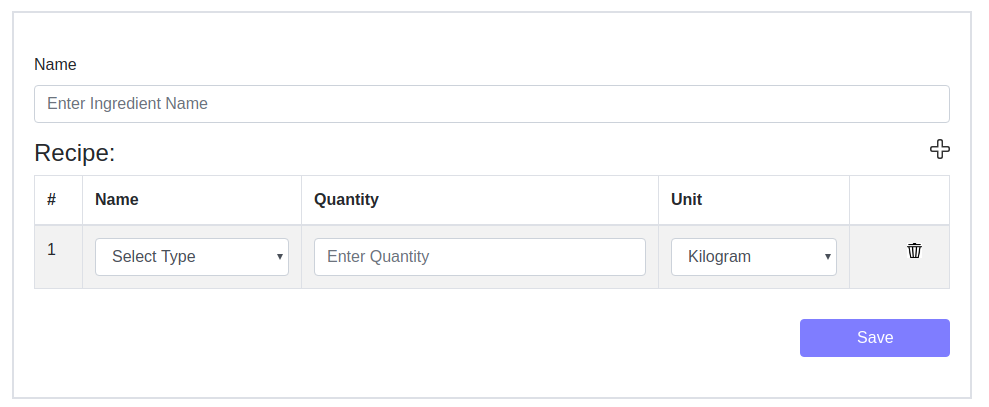
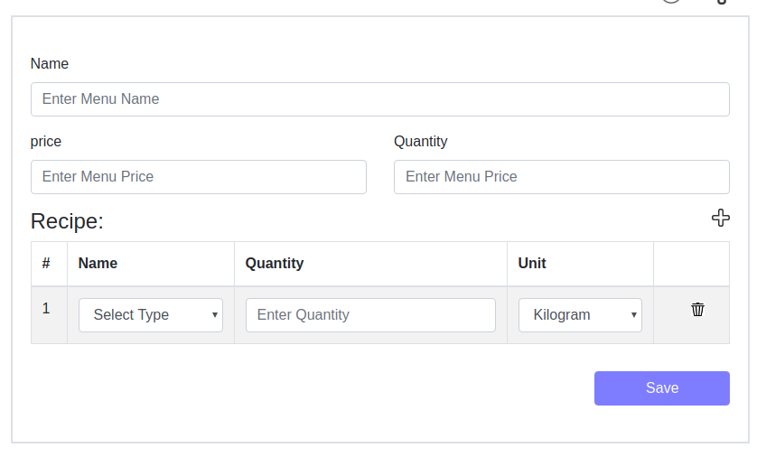

# Prerequisites

This project required listed tools to work properly

- NodeJS & NPM
- Mysql
- NestJs
- TypeORM
- ReactJs


# NestJs Environment Setup

- install nest js 

```sh
$ npm i -g @nestjs/cli
```

- Install project dependencies 

```sh
$ npm install
```

> this will install all required dependencies for nest framework


# ReactJs Environment Setup

- open terminal in react-app directory and run 

```
$ npm install
```
> This will install all required dependencies to run react app


#TypeORM Config

- create database <b>restaurant</b> in mysql server.
- open ormconfig.json exists on root directory
- set database, host, username and password for database connection

> all required tables will be created from entity files when nest server will run

 
 # Run NestJs Server
 
 - open terminal in root directory and run
 ```
 $ nest start
 ```

# Run React Webpack Server

- open terminal in react-app directory and run

```
$ npm start
```


- Open app in browser user following link

```
http://localhost:8010
```

- main page has three links for inventory, menu and ingredients


#Inventory 

- Click on inventory link
> It will redirect you to inventory page, it has list of existing inventory item 


- to reload inventoy list click on reload button 
- to add new inventory item click on add button 
- to edit an item click on edit button 
- to delete an item click on delete button 

# Ingredient

- click on ingredient list


> Ingredients list has all ingredients


- to reload ingreident list click on reload button 
- to delete an ingredient click on delete button 
- click on details icon  to view the details of ingredient


- click on calculate cost to get the cost of ingredient.


- to edit an ingredient click on edit button 


> you can add new inventory/ingredient in the list through  button on top of recipe items list.


- to add new ingredient item click on add button 




# Menu

- click on menu list


> Ingredients list has all menus


- to reload ingreident list click on reload button 
- to delete an menu click on delete button 
- click on details icon  to view the details of menu


- click on calculate cost to get the cost of menu.


- to edit an menu click on edit button 


> you can add new inventory/menu in the list through  button on top of recipe items list.


- to add new menu item click on add button 


